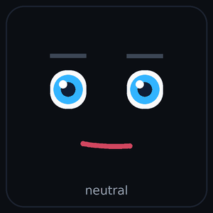

# ESPHome LVGL Kawaii Face 😊

An **ESPHome external component** that draws an animated *kawaii* face on an
[LVGL 9](https://lvgl.io/) display and lets it **react to your voice
assistant** (and anything else in ESPHome).

<p align="center">
  
  <br>
  <sub><em>Illustrative preview (mock-up) — the face moving through several of its expressions.</em></sub>
</p>

It renders eyes, eyebrows, blush and a mouth on LVGL canvases with per‑emotion
animations — blinking, bouncing, sparkles, pupil movement, tears, sweat drops —
and exposes the current expression as ESPHome **actions**, so the face can
follow your Home Assistant voice pipeline: *waking up → listening → thinking →
speaking → idle*, and even change its mood based on **what the assistant
replies**.

> This is the ESPHome integration of the excellent
> [`0015/lvgl_kawaii_face`](https://github.com/0015/lvgl_kawaii_face) C
> component by Eric Nam. The original C source is vendored here unchanged; this
> repo adds the ESPHome wrapper (config, actions, voice‑assistant glue).

---

## Table of contents

- [Features](#features)
- [Emotions](#emotions)
- [Requirements](#requirements)
- [Installation](#installation)
- [Quick start](#quick-start)
- [Configuration reference](#configuration-reference)
- [Actions](#actions)
- [Voice assistant integration](#voice-assistant-integration)
- [Reacting to the assistant's reply](#reacting-to-the-assistants-reply)
- [ESP32‑P4 / PPA (Waveshare, etc.)](#esp32p4--ppa-waveshare-etc)
- [How it works](#how-it-works)
- [Troubleshooting](#troubleshooting)
- [Credits & license](#credits--license)

---

## Features

- 🎭 **17 expressions** with smooth transitions between any two.
- 👀 Automatic blinking, idle micro‑animations, sparkles, tears, sweat…
- 🗣️ **Voice‑assistant ready**: one action per pipeline phase.
- 🧠 **Follows the reply**: pick an emotion from the content of the spoken
  answer (keyword rules, FR/EN defaults built in).
- 📐 **Resolution independent**: the face fills and scales to any parent object.
- ⚡ **ESP32‑P4 + PPA friendly** (LVGL 9.5): RGB565 canvases, safe software
  fallback, cache‑coherent.
- 🧩 Self‑contained: drop‑in `external_components`, no manual file copying.

---

## Emotions

| Name | Expression |
|---|---|
| `neutral` | Resting face with idle glance and micro‑smile |
| `happy` | Wide eyes, big smile, energetic bounce, sparkles |
| `worried` | Nervous smile, twitching raised eyebrows |
| `sad` | Droopy eyes, deep frown, falling tears |
| `cry` | Squinted eyes, sobbing tremor, tear streams |
| `surprised` | Wide eyes, pulsing mouth, shock vibration |
| `angry` | Furrowed brows, rage‑flush blush, jaw tremble |
| `sleepy` | Half‑closed eyes, slow nod, lazy sweat drip |
| `wink` | One eye closed, playful smile |
| `love` | Heart‑shaped eyes, heartbeat float, max blush |
| `playful` | Wide grin, wagging tongue, bounce |
| `silly` | Cross‑eyed, darting pupils, goofy grin |
| `smirk` | Asymmetric brows, slow side‑glance |
| `working_hard` | Gritted teeth, focused gaze, dripping sweat |
| `excited` | Rapidly darting pupils, huge grin, rapid bounce |
| `confused` | Asymmetric brows, wandering pupils, head‑tilt |
| `cool` | Half‑lidded squint, slow confident glance |

**Voice‑assistant aliases** (handy when wiring the pipeline): `idle`→neutral,
`listening`→surprised, `thinking`→working_hard, `speaking`/`talking`→happy,
`error`→sad.

---

## Requirements

| | |
|---|---|
| **ESPHome** | 2024.x or newer |
| **LVGL** | 9.x (tested on 9.5) via the ESPHome `lvgl` component |
| **MCU** | ESP32 family (ESP32‑S3, **ESP32‑P4**, …) with a display |
| **LVGL canvas** | `LV_USE_CANVAS` must be enabled (see note below) |

> **About `LV_USE_CANVAS`** — the face draws on LVGL canvases. The
> [`youkorr/lvgl_9.5`](https://github.com/youkorr/lvgl_9.5) LVGL fork always
> compiles canvas in (and adds ESP32‑P4 PPA acceleration), so it works out of
> the box. With upstream ESPHome LVGL, make sure at least one `canvas:` widget
> exists in your `lvgl:` config so canvas support is enabled.

---

## Installation

Add the component (and an LVGL build) to `external_components`:

```yaml
external_components:
  # This component
  - source: github://youkorr/esphome-lvgl-kawaii
    components: [lvgl_kawaii_face]

  # Recommended LVGL build (canvas always on + ESP32‑P4 PPA).
  # Skip this block if you already configure lvgl from elsewhere with canvas.
  - source: github://youkorr/lvgl_9.5
    components: [lvgl]
```

---

## Quick start

```yaml
# 1) A plain LVGL object the face fills and scales to.
lvgl:
  pages:
    - id: page_face
      widgets:
        - obj:
            id: face_panel
            width: 240
            height: 240
            align: CENTER
            bg_opa: TRANSP
            border_width: 0
            pad_all: 0

# 2) The face itself.
lvgl_kawaii_face:
  id: face
  parent_id: face_panel
  initial_emotion: neutral

# 3) Drive it from anywhere.
button:
  - platform: template
    name: "Be happy"
    on_press:
      - lvgl_kawaii_face.set_emotion: { id: face, emotion: happy }
```

---

## Configuration reference

```yaml
lvgl_kawaii_face:
  id: face                    # required
  parent_id: face_panel       # optional: an LVGL widget id. Omit = active screen
  initial_emotion: neutral    # expression shown at boot
  animation_speed: 30ms       # timer interval (~33 FPS)
  blink_interval: 3000ms      # auto‑blink period
  auto_blink: true            # enable automatic blinking
  smooth: true                # smooth transitions between expressions
  response_fallback: speaking # emotion when a reply matches no keyword
  response_keywords:          # optional; overrides the built‑in FR/EN defaults
    happy: ["bravo", "super", "done", "great"]
    sad:   ["désolé", "error", "sorry"]
```

| Option | Default | Description |
|---|---|---|
| `id` | — | Component id (required). |
| `parent_id` | *(screen)* | LVGL widget id the face fills. Omit to use the active screen. |
| `initial_emotion` | `neutral` | Expression shown at boot. |
| `animation_speed` | `30ms` | Animation update interval. |
| `blink_interval` | `3000ms` | Auto‑blink period. |
| `auto_blink` | `true` | Enable automatic blinking. |
| `smooth` | `true` | Smoothly transition between expressions. |
| `response_fallback` | `speaking` | Emotion used by `set_emotion_from_text` when nothing matches. |
| `response_keywords` | *(FR/EN defaults)* | Map of `emotion: [keywords]` for `set_emotion_from_text`. |

> The underlying C component is a **singleton** — configure a single
> `lvgl_kawaii_face:` block (one animated face per device).

---

## Actions

### `lvgl_kawaii_face.set_emotion`

Set the expression by name (templatable — a lambda is allowed):

```yaml
- lvgl_kawaii_face.set_emotion:
    id: face
    emotion: love

- lvgl_kawaii_face.set_emotion:
    id: face
    emotion: !lambda 'return id(door_open) ? "surprised" : "neutral";'
```

### `lvgl_kawaii_face.set_emotion_from_text`

Pick an expression from a piece of **text** (e.g. the assistant's reply): it
scans for keywords and applies the matching emotion, or `response_fallback`
when nothing matches.

```yaml
- lvgl_kawaii_face.set_emotion_from_text:
    id: face
    text: !lambda 'return x;'
```

---

## Voice assistant integration

Wire the actions into the standard `voice_assistant:` triggers. Add them to your
**existing** triggers if you already have a `voice_assistant:` block.

```yaml
voice_assistant:
  id: va
  # microphone / media_player / micro_wake_word: your hardware

  on_wake_word_detected:
    - lvgl.page.show: page_face
    - lvgl_kawaii_face.set_emotion: { id: face, emotion: excited }

  on_listening:
    - lvgl_kawaii_face.set_emotion: { id: face, emotion: listening }

  on_stt_end:
    - lvgl_kawaii_face.set_emotion: { id: face, emotion: thinking }

  on_tts_start:                                   # follows the reply (see below)
    - lvgl_kawaii_face.set_emotion_from_text: { id: face, text: !lambda 'return x;' }

  on_error:
    - lvgl_kawaii_face.set_emotion: { id: face, emotion: error }

  on_end:
    - lvgl_kawaii_face.set_emotion: { id: face, emotion: neutral }
```

| Trigger | `x` value | Suggested emotion |
|---|---|---|
| `on_wake_word_detected` | — | `excited` |
| `on_listening` | — | `listening` |
| `on_stt_end` | recognised text | `thinking` |
| `on_tts_start` | **reply text** | `set_emotion_from_text` |
| `on_error` | — | `error` |
| `on_end` / `on_idle` | — | `neutral` |

---

## Reacting to the assistant's reply

`on_tts_start` provides the spoken reply as `x`. `set_emotion_from_text` scans
that text and picks an emotion (first matching keyword wins, case‑insensitive).
Built‑in defaults cover common FR/EN cues:

- errors/apologies → `sad`
- praise/confirmations → `happy`
- questions/uncertainty → `confused`
- "je t'aime" / "i love you" → `love`
- warnings → `surprised`

Override them per emotion in the component config:

```yaml
lvgl_kawaii_face:
  id: face
  response_fallback: speaking
  response_keywords:
    sad:       ["désolé", "erreur", "je n'ai pas", "sorry", "error"]
    happy:     ["bravo", "super", "c'est fait", "done", "great"]
    confused:  ["je ne comprends", "not sure"]
    love:      ["je t'aime", "i love you"]
    surprised: ["attention", "alerte", "warning"]
```

> For the most precise behaviour, prompt your LLM/agent to phrase replies with
> clear emotional cues, or have Home Assistant decide the emotion and call
> `set_emotion` directly.

---

## ESP32‑P4 / PPA (Waveshare, etc.)

Fully compatible with LVGL 9.5 and the PPA‑accelerated display path — no special
configuration:

- The face renders to **RGB565** canvases, matching the default
  `color_depth: 16` on `mipi_dsi` panels.
- The PPA draw unit evaluates each task and **falls back to software** for
  buffers that aren't 16‑byte aligned (or rounded rects / opacity / gradients),
  so the small face canvases never crash; cache coherency is handled with
  `esp_cache_msync`. PPA framebuffer rotation is unaffected.
- Works alongside `use_ppa: true` / `use_ppa_img: true`.

A board‑specific snippet for the Waveshare ESP32‑P4 7″ (1024×600) is provided in
[`components/lvgl_kawaii_face/example_esp32p4_waveshare.yaml`](components/lvgl_kawaii_face/example_esp32p4_waveshare.yaml).

Canvas buffers (tens of KB) are allocated in internal RAM first, then PSRAM —
both PPA‑accessible. Increase the `face_panel` size for a larger face.

---

## How it works

```
components/lvgl_kawaii_face/
├── __init__.py              # ESPHome config schema + codegen + actions
├── kawaii_face.h            # C++ wrapper: name→emotion, locking, deferred init
├── lvgl_kawaii_face.c/.h    # vendored C component (upstream, unchanged*)
├── example.yaml             # generic voice‑assistant example
└── example_esp32p4_waveshare.yaml
```

- The C++ `KawaiiFaceComponent` runs at `LATE` setup priority. On the first
  `loop()` (LVGL fully up) it calls `face_animation_init()` on your `parent_id`
  object — or the active screen.
- LVGL thread‑safety is routed through `lv_lock()` / `lv_unlock()`.
- Emotion names map to the C `face_emotion_t`; `set_emotion_from_text` adds the
  keyword matching layer.

\* The only change to the upstream header is `extern "C"` guards so the C
symbols link cleanly into the C++ wrapper.

---

## Troubleshooting

- **Blank / no face** — check the `parent_id` widget exists, has a non‑zero
  size, and is on the visible page. With upstream LVGL, ensure canvas is
  enabled (see [Requirements](#requirements)).
- **Linker error about canvas** — `LV_USE_CANVAS` is off. Use the
  `youkorr/lvgl_9.5` LVGL fork or add a `canvas:` widget.
- **Out of memory** — reduce the `face_panel` size, or ensure PSRAM is enabled.
- **Emotion not changing on reply** — `on_tts_end` carries the media URL, not
  text; react in **`on_tts_start`** (where `x` is the reply text).

---

## Credits & license

- Original kawaii face C component:
  [**0015/lvgl_kawaii_face**](https://github.com/0015/lvgl_kawaii_face) by
  **Eric Nam**.
- ESPHome wrapper & voice‑assistant integration: this repository.
- LVGL fork with ESP32‑P4 PPA: [youkorr/lvgl_9.5](https://github.com/youkorr/lvgl_9.5).

Licensed under the **MIT License** — see [`LICENSE`](LICENSE).
